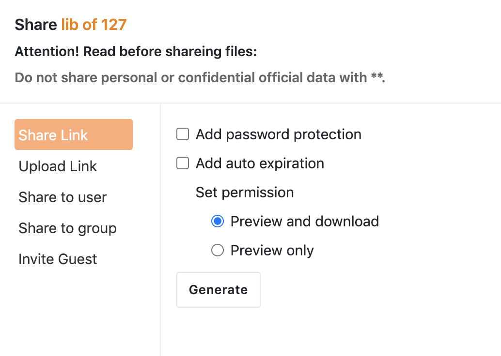

# Seahub customization

## Customize Seahub Logo and CSS

Create a folder `<seafile-install-path>/seahub-data/custom`. Create a symbolic link in `seafile-server-latest/seahub/media` by `ln -s ../../../seahub-data/custom custom`.

During upgrading, Seafile upgrade script will create symbolic link automatically to preserve your customization.

### Customize Logo

Add your logo file to `custom/`

Overwrite `LOGO_PATH` in `seahub_settings.py`

```python
LOGO_PATH = 'custom/mylogo.png'
```

Default width and height for logo is 149px and 32px, you may need to change that according to yours.

```python
LOGO_WIDTH = 149
LOGO_HEIGHT = 32
```

### Customize Favicon

Add your favicon file to `custom/`

Overwrite `FAVICON_PATH` in `seahub_settings.py`

```python
FAVICON_PATH = 'custom/favicon.png'
```

### Customize Seahub CSS

Add your css file to `custom/`, for example, `custom.css`

Overwrite `BRANDING_CSS` in `seahub_settings.py`

```python
BRANDING_CSS = 'custom/custom.css'
```

You can find a good example of customized css file here: <https://github.com/focmb/seafile_custom_css_green>

## Customize help page

**Note:** Since version 2.1.

First go to the custom folder

```
cd <seafile-install-path>/seahub-data/custom
```

then run the following commands

```
mkdir templates
mkdir templates/help
cp ../../seafile-server-latest/seahub/seahub/help/templates/help/install.html templates/help/
```

Modify the `templates/help/install.html` file and save it. You will see the new help page.

## Add an extra note in sharing dialog

You can add an extra note in sharing dialog in seahub_settings.py

```
ADDITIONAL_SHARE_DIALOG_NOTE = {
    'title': 'Attention! Read before shareing files:',
    'content': 'Do not share personal or confidential official data with **.'
}
```

Result:




## Add custom navigation items

Since Pro 7.0.9, Seafile supports adding some custom navigation entries to the home page for quick access. This requires you to add the following configuration information to the `conf/seahub_settings.py` configuration file:

```
CUSTOM_NAV_ITEMS = [
    {'icon': 'sf2-icon-star',
     'desc': 'Custom navigation 1',
     'link': 'https://www.seafile.com'
    },
    {'icon': 'sf2-icon-wiki-view',
     'desc': 'Custom navigation 2',
     'link': 'https://download.seafile.com/published/seafile-manual/home.md'
    },
    {'icon': 'sf2-icon-wrench',
     'desc': 'Custom navigation 3',
     'link': 'http://www.example.com'
    },
]
```

**Note: The **`icon` **field currently only supports icons in Seafile that begin with **`sf2-icon`**. You can find the list of icons here: **<https://github.com/haiwen/seahub/blob/7.0/media/css/seahub.css#L146>

Then restart the Seahub service to take effect.

Once you log in to the Seafile system homepage again, you will see the new navigation entry under the `Tools` navigation bar on the left.

## Add more links to the bottom bar

```
ADDITIONAL_APP_BOTTOM_LINKS = {
    'seafile': 'https://example.seahub.com/seahub',
    'dtable-web': 'https://example.seahub.com/web'
}
```

Result:


## Add more links to about dialog

```
ADDITIONAL_ABOUT_DIALOG_LINKS = {
    'seafile': 'https://example.seahub.com/seahub',
    'dtable-web': 'https://example.seahub.com/dtable-web'
}
```

Result:


